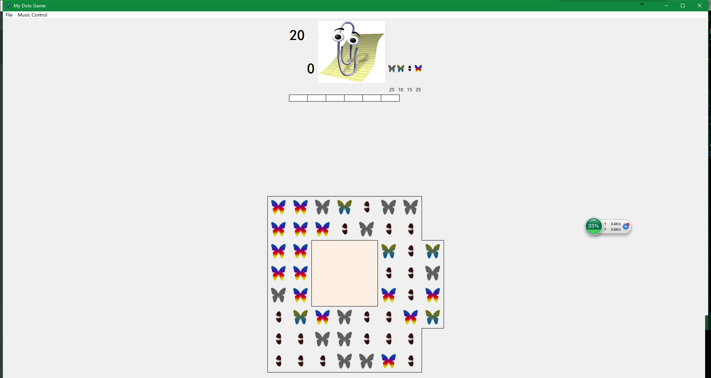

# python 可视化编程作业
## 连连看游戏

主要是使用tk这个包，结合一些算法和逻辑。

除此之外，还需要对python的文件读写，继承，多态，抽象类等高级特性熟悉，不然很难设计出一个完善的作业。

## 环境

- windows或linux
- 戴上耳机
- python3.6
- 各种包，文件开头，都有，自己pip install (2017年10月24日发现最近一周清华的镜像坏了，pip好慢)


## 运行方法

```python a3.py```


## 运行截图


